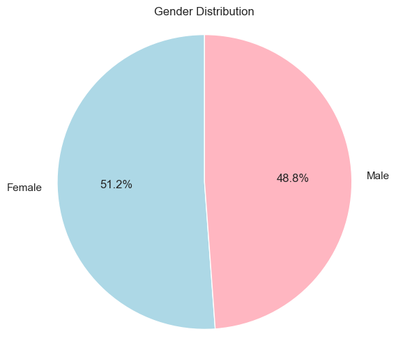
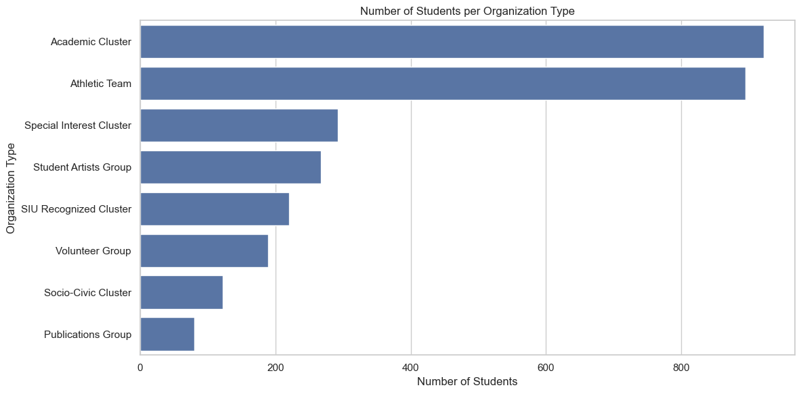
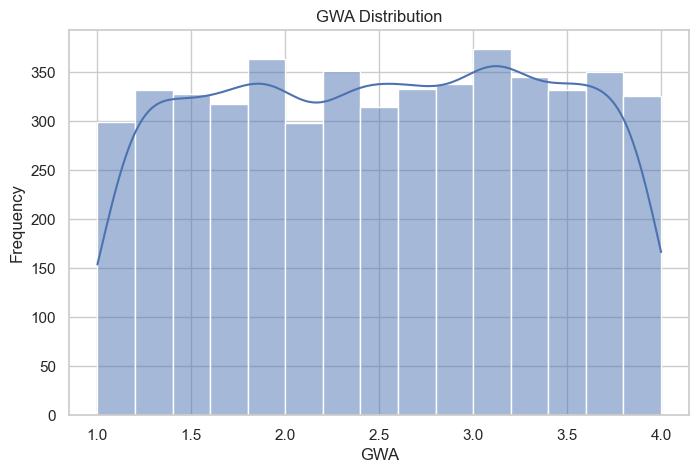
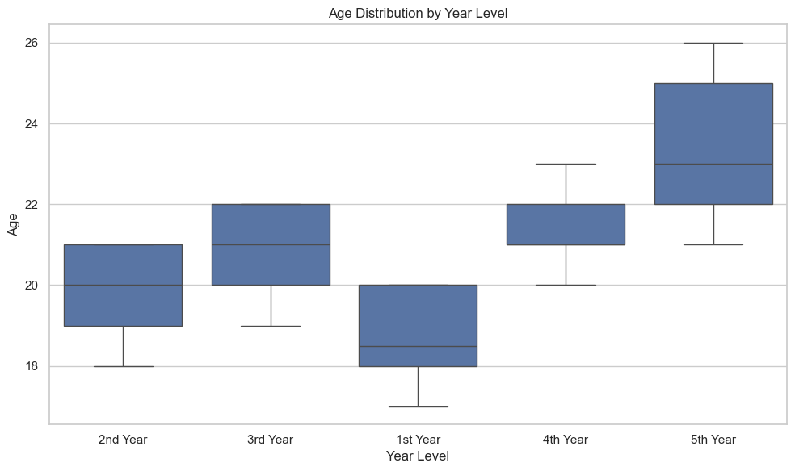
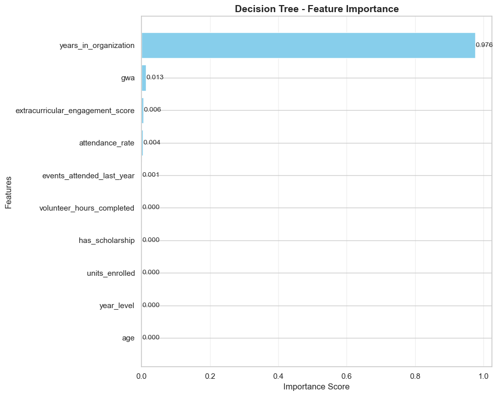
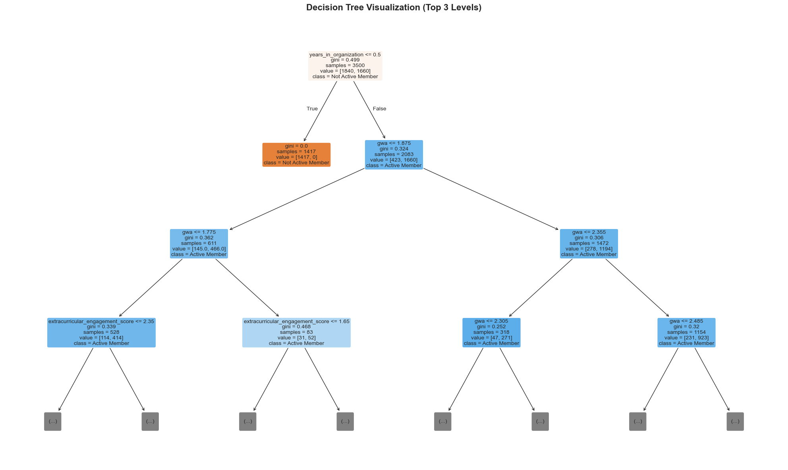
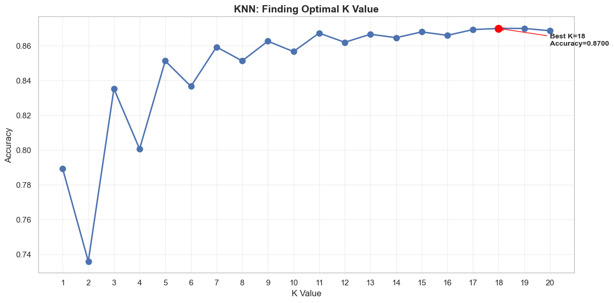
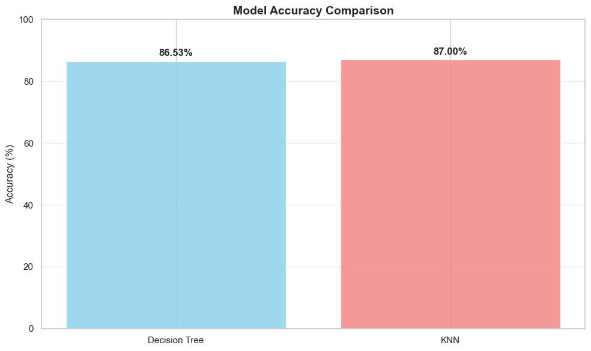
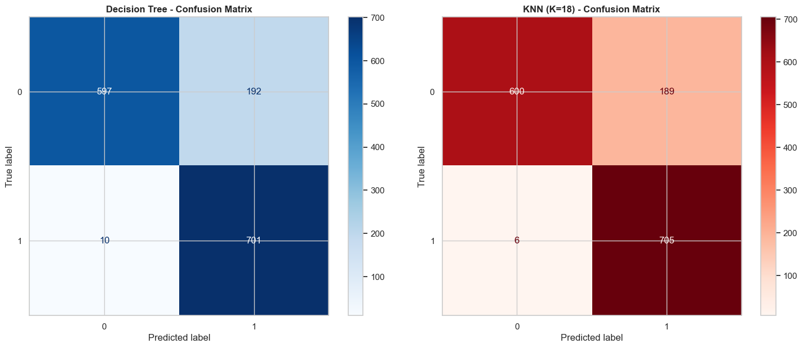

# DLS-CSB Student Organizations Data Analysis

A machine learning analysis of student organizations and academic performance at De La Salle-College of Saint Benilde (DLS-CSB).

## Dataset Overview

This study analyzes 5,000 students across 35 diverse academic programs at DLS-CSB, tracking 27 variables related to academics, organizational involvement, and graduation readiness. The dataset maintains balanced demographics with 51% female and 49% male students, primarily from Metro Manila areas with 92% Filipino nationality.

## Dataset Code Generation
Dataset Access: benilde_student_organizations_dataset_5000.csv

## Findings

### Student Demographics
The analysis reveals nearly equal gender representation (51.2% female, 48.8% male) across the student body. Age progression follows expected academic patterns, with 1st year students ranging from 17-20 years old progressing to 5th year students aged 21-26. Academic performance demonstrates normal distribution with GWA (General Weighted Average) centered around 2.5-3.0, indicating typical performance across the student population.

### Organizational Participation Analysis
Academic Clusters and Athletic Teams dominate student participation rates, significantly outpacing other organization types such as Special Interest groups and Student Artists organizations. The data shows that years of organizational involvement serves as the strongest predictor of student outcomes, with an importance score of 0.976 in the decision tree model.

### Classification Patterns
Students with less than 0.5 years in organizations are typically classified as "Not Active Members," while those with extended organizational experience combined with better academic performance (higher GWA) tend to be classified as "Active Members."

## Machine Learning Model Performance

### Comparative Analysis
Two machine learning algorithms were implemented and compared for predicting student classification:

**K-Nearest Neighbors (KNN):**
- Accuracy: 87.0%
- Optimal K value: 18 (determined through systematic testing of K values 1-20)
- Superior precision with fewer false positives (189) and false negatives (6)

**Decision Tree:**
- Accuracy: 86.53%
- High interpretability with clear decision rules
- Effective feature importance identification

The KNN model demonstrates better overall performance and prediction reliability, though both algorithms achieve strong accuracy rates in the 86-87% range.

## Visualization Analysis

### Gender Distribution


The gender distribution chart confirms balanced representation across the student body, with 51.2% female students and 48.8% male students participating in organizational activities.

### Organizational Type Participation


Academic Clusters and Athletic Teams show the highest student engagement levels, with participation rates significantly exceeding Special Interest Clusters, Student Artists Groups, SIU Recognized Clusters, Volunteer Groups, Socio-Civic Clusters, and Publications Groups.

### Academic Performance Distribution


GWA distribution follows a normal bell curve pattern centered between 2.5-3.0, indicating standard academic performance across the student population without significant skewing toward either high or low performance extremes.

### Age and Year Level Correlation


Box plot analysis demonstrates expected age progression by academic year, with 1st year students (ages 17-20) advancing through 5th year students (ages 21-26), showing normal academic progression with some variation due to individual circumstances.

### Feature Importance Analysis


Decision tree analysis identifies "years in organization" as the overwhelmingly dominant predictor (0.976 importance), with other factors like GWA (0.013), extracurricular engagement score (0.006), and attendance rate (0.004) showing minimal comparative influence.

### Decision Tree Visualization


The decision tree visualization shows the classification logic, with "years in organization" as the primary splitting criterion at 0.5 years, followed by GWA thresholds for further classification refinement.

### KNN Optimization


KNN model optimization reveals K=18 as the optimal value, achieving 87.0% accuracy through systematic testing of K values from 1-20, with performance stabilizing in the higher K range.

### Model Performance Comparison


Direct comparison shows KNN (87.0%) outperforming Decision Tree (86.53%) in overall accuracy, demonstrating the effectiveness of distance-based classification for this dataset.

### Confusion Matrices


Confusion matrix analysis reveals KNN's superior performance with fewer classification errors. KNN shows 600 correct predictions for class 0 with 189 false positives, and 705 correct predictions for class 1 with only 6 false negatives, compared to Decision Tree's 597 and 701 correct predictions respectively, with 192 false positives and 10 false negatives.

## Repository Structure

```
STUDENT-ORG-ML/
├── dataset/
│   ├── benilde_student_organizations_dataset_5000.csv
│   └── benilde-student-org-dataset-code.ipynb
├── visualization/
│   ├── student-org-age-distribution-5.png
│   ├── student-org-attendance-rate-6.png
│   ├── student-org-confusion-matrix-13.png
│   ├── student-org-decision-tree-10.png
│   ├── student-org-feature-importance-8.png
│   ├── student-org-gender-distribution-1.png
│   ├── student-org-gender-distribution-2.png
│   ├── student-org-gwa-distribution-4.png
│   ├── student-org-knn-11.png
│   ├── student-org-model-perf-comparison-12.png
│   ├── student-org-model-performance-9.png
│   ├── student-org-org-type-3.png
│   └── student-org-top10-7.png
├── salvador-student-org-data-analysis.html
├── salvador-student-org-data-analysis.ipynb
└── README.md
```

## Getting Started

### Prerequisites
```bash
pip install pandas numpy matplotlib seaborn scikit-learn jupyter
```

### Running the Analysis
1. Clone the repository
2. Open `salvador-student-org-data-analysis.ipynb` in Jupyter Notebook
3. Run all cells to reproduce the analysis and visualizations

## Visualizations

This repository includes visualizations covering demographics, academic performance, organizational analysis, model performance metrics, and feature importance rankings. Each visualization provides specific insights into different aspects of student organizational involvement and academic success patterns.

## Dataset Code Generation

Dataset for DLS-CSB's List of Accredited Student Organizations and Recognized Student Groups

**References Used:**
- De La Salle-College of Saint Benilde. (n.d.). *De La Salle-College of Saint Benilde Center for Student Life List of Accredited Student Organizations and Recognized Student Groups Academic Year 2024-2025*. https://www.benilde.edu.ph/wp-content/uploads/2024/11/List-of-Accredited-Student-Org-and-Recognized-Student-Groups-AY-24-25.docx.pdf
- De La Salle-College of Saint Benilde. (2019). *LIST OF DEGREE PROGRAMS AND DEGREE CODES*. https://apps1.benilde.edu.ph/Apply/docs/Degree%20Programs%20and%20Degree%20Codes.pdf
- DLSCSB Official. (2021). *List of Programs*. Benilde. https://archive.benilde.edu.ph/admissions/list-of-programs/

## Contributing

Contributions are welcome through additional analysis approaches, model performance improvements, new visualization development, and documentation enhancement.

## License

This project is for educational and research purposes.

---


*Analysis conducted for De La Salle-College of Saint Benilde student organization research.*


